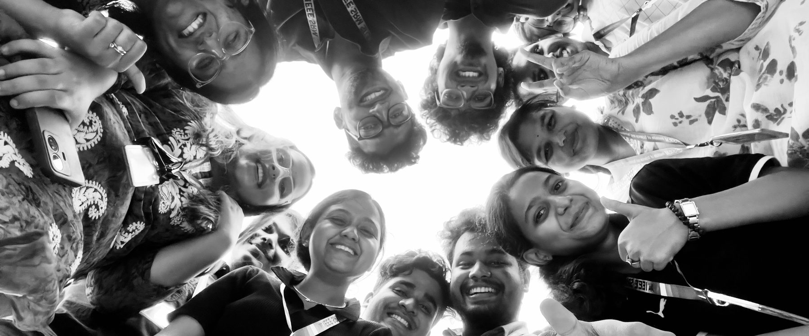

# IEEE SRMIST

The IEEE Student Branch of SRM Institute of Science and Technology, Kattankulathur. We run workshops, hackathons, ideathons and talks that help students learn and build with new technology.

Our events include Concepto, HackTrix, EVOLVE, Protocol, TechTrek, TechnoZest, Hyperforge and HELLO CLOUD!

## Tech stack

[Website](https://www.ieeesrmist.com) · [Instagram](https://www.instagram.com/ieeesrmist) · [LinkedIn](https://www.linkedin.com/company/ieeesrmist/) · [X](https://x.com/ieeesrmist) · [Email](mailto:contact@ieeesrmist.com)
